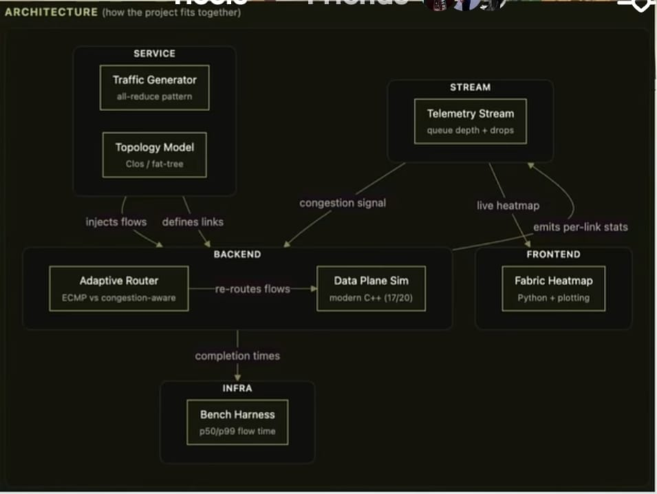
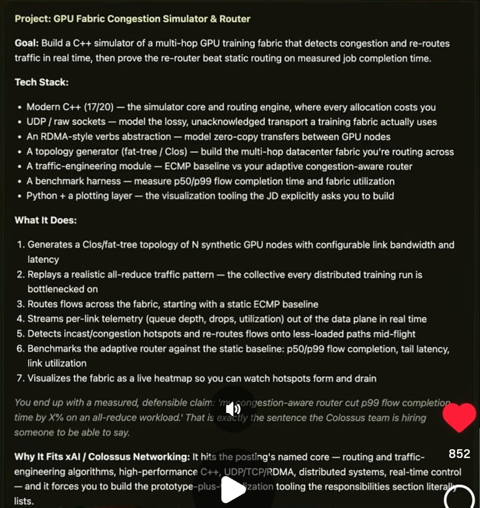

# FabricSim: Adaptive Congestion-Aware Router & GPU Topology Simulator



Welcome to **FabricSim**, a high-performance C++ simulation framework designed for modeling and analyzing adaptive, congestion-aware routing algorithms across various GPU interconnect topologies. 

As multi-GPU systems scale to meet the demands of large-scale machine learning and high-performance computing (HPC), the underlying network topology and routing strategy become critical bottlenecks. This project aims to build a simulator of a multi-hop GPU training fabric that detects congestion and re-routes traffic in real time, ultimately proving that the re-router beats static routing on measured job completion time.

## 🏗️ Architecture



## 🗺️ Learning & Implementation Modules

This project is structured systematically, progressing from networking fundamentals to a fully visualized, congestion-aware fabric simulator.

### Module 1: Networking fundamentals (concepts only, no code yet)
This is the foundational layer — many developers know HTTP, but might not know what's underneath it.

*   **Research**: OSI model (just enough to place UDP vs TCP), what a socket actually is, why UDP is lossy/unordered and TCP isn't, what "raw sockets" means. Also skim: what RDMA is and why datacenters use it (search "RDMA vs TCP/IP datacenter", "RoCE explained").
*   **Do**: nothing yet. Just be able to explain, out loud, "here's what happens when one machine sends a UDP packet to another."

### Module 2: Sockets in C++ (first real code)
*   **Research**: POSIX socket API or Boost.Asio basics — pick one (Boost.Asio is more forgiving for a beginner).
*   **Do**: write the simplest possible thing — two programs on your machine, one sends a UDP message, one receives it and prints it. That's it. This is your "hello world" for the whole project.
*   **Signal you're ready**: you can explain bind/send/recv without looking it up.

### Module 3: Topology generator (Clos/fat-tree)
*   **Research**: the fat-tree paper concept (don't need to read the whole paper — get the idea: multi-tier switches, why it avoids bottlenecks). Search "fat-tree topology explained simply" first, dig into the paper only if curious.
*   **Do**: represent a fat-tree as a graph in C++ (nodes + edges, adjacency list). No networking yet — this is a data structure exercise.
*   **Signal you're ready**: you can draw a small fat-tree on paper and explain why traffic between two "leaf" nodes might cross multiple "core" switches.

### Module 4: Traffic generator (all-reduce pattern)
*   **Research**: what all-reduce is in distributed training (search "all-reduce explained ML training", ring all-reduce is the classic one to understand) — and why it creates "incast" (many senders → one receiver, congestion).
*   **Do**: write code that generates a set of synthetic "flows" over your Module 3 topology, simulating an all-reduce pattern.
*   **Signal you're ready**: you can explain, in your own words, why all-reduce causes congestion and where.

### Module 5: Static routing baseline (ECMP)
*   **Research**: what ECMP (Equal-Cost Multi-Path) routing is, and how a 5-tuple hash is typically used to pick a path.
*   **Do**: implement it — given a flow, hash it, pick a path across your topology.
*   **Signal you're ready**: you can explain why ECMP can still cause hash collisions/hotspots even though it "spreads" traffic.

### Module 6: Data-plane simulator (the core sim loop)
This is where your sockets (Module 2) + topology (Module 3) + traffic (Module 4) + routing (Module 5) all combine into a discrete-event or tick-based simulation.

*   **Research**: "discrete event simulation basics" — you don't need a fancy library, just the concept (a simulation clock, an event queue).
*   **Do**: simulate flows moving across links, tracking queue depth/utilization per link over simulated time.
*   *Note: This is the hardest module. Budget the most time here.*

### Module 7: Telemetry streaming
*   **Research**: basic IPC options — a plain socket or file-based streaming is fine, don't overengineer.
*   **Do**: stream per-link stats (queue depth, drops, utilization) out of your sim in real time.

### Module 8: Adaptive/congestion-aware router
*   **Research**: skim CONGA or Hedera papers just for the core idea (don't need full understanding) — "detect congestion signal, re-route flow mid-flight."
*   **Do**: this is your novel logic — write the heuristic yourself, don't let AI design this part. This is the sentence you want to say in the interview.

### Module 9: Benchmark harness
*   **Research**: what p50/p99 latency means (percentiles) if you're not already familiar.
*   **Do**: measure flow completion times for both routers, compare.

### Module 10: Python visualization
This is where we map telemetry "data → visual." using Python tools like matplotlib or Plotly.
*   **Do**: read telemetry stream, render as a live heatmap.

## 📦 Installation & Usage

### Prerequisites
- A C++17 compliant compiler (`g++` or `clang++`)
- `make`
- Python 3.9+ (for visualization)

### 1. Build the Simulator
```bash
git clone https://github.com/swiftkimani/FabricSim.git
cd FabricSim
make
```

### 2. Run the Demos
The project compiles several executable examples in the `bin/` directory:

- **Topology Test**: Verifies the Fat-Tree graph generation.
  ```bash
  ./bin/test_topology
  ```
- **Adaptive Routing Benchmark**: Compares latency between ECMP and Adaptive routing under heavy load.
  ```bash
  ./bin/test_adaptive_routing
  ```
- **Visualization Demo**: Prints an interactive packet path trace showing dynamic re-routing in action.
  ```bash
  ./bin/visualize_adaptive
  ```

### 3. Run the Live Telemetry Heatmap (Python)
To view a live heatmap of network congestion, first set up the Python environment:
```bash
python3 -m venv scripts/venv
source scripts/venv/bin/activate
pip install matplotlib pandas seaborn
```

Then, run the telemetry data generator in one terminal:
```bash
./bin/test_telemetry_stream
```

And in a second terminal (with the venv activated), launch the visualizer:
```bash
python scripts/visualize_heatmap.py
```

## 📄 License

This project is licensed under the MIT License - see the [LICENSE](LICENSE) file for details.
